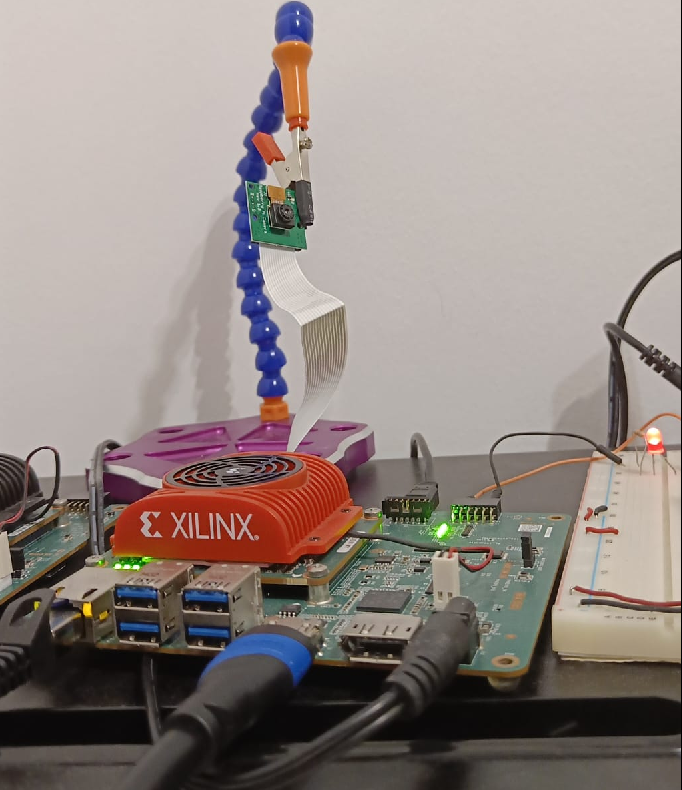
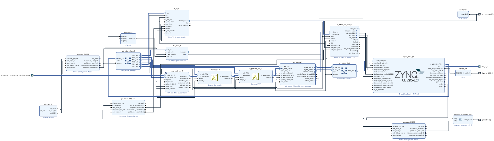

# Forwarding the video to the DP output with Ubuntu running on the PS

## Table of contents
<ol>
    <li><a href="#About-The-Project">About the project</a></li>
    <li><a href="#Hardware-Design">Hardware Design</a></li>
    <li><a href="#Software-design">Software design</a></li>
    <li><a href="#Prerequisites">Prerequisites</a></li>
    <li><a href="#Usage">Usage</a></li>
    <li><a href="#References">References</a></li>
    <li><a href="#Contact">Contact</a></li>
</ol>

## About the project <a id="About-The-Project"></a>

The `KV260` platform comes with a `MIPI CSI` port to connect a Raspberry Pi camera. This project focuses on interfacing one of those cameras and forward its video stream all the way up to the video output (HDMI). In particular, a `OV5647` sensor (featured by the `Raspberry PI camera rev 1.3`) is used.



## Hardware design <a id="Hardware-Design"></a>

From the FPGA perspective, the RPI camera interface is connected to a `MIPI CSI-2 RX` block. The output stream goes through a `demosaic` IP (to convert the camera RAW format into RGB) and then a `gamma lut` IP. Then, it is forwarded by a `VDMA` to a `AXIS to Video` IP to finally reach the video out through the `Display Port controller` (external to the PL).

The `PS-PL I2C interface` must be enabled so that the sensor can be initialised from the PS.

The resulting Vivado block diagram is shown below.



## Software design <a id="Software-design"></a>

From the processor perspective, a standalone application running on the APU is in charge of initialising all the IPs, including the OV5647 image sensor (via I2C).

## Prerequisites <a id="Prerequisites"></a>

- [AMD Vivado Design Suite](https://www.xilinx.com/products/design-tools/vivado.html) for generating the project, the output artefacts, programming the FPGA, etc.
- [cocotb](https://www.cocotb.org/) as testbenching framework.
- [Questa advanced simulator](https://eda.sw.siemens.com/en-US/ic/questa/simulation/advanced-simulator/) as simulator. Opensource alternatives such as [GHDL](https://github.com/ghdl/ghdl) + [gtkwave](https://github.com/gtkwave/gtkwave) are also good options (they would require minor modifications in the test Makefile).
- [AMD KV260](https://www.xilinx.com/products/som/kria/kv260-vision-starter-kit.html)
- External monitor
- HDMI or DisplayPort cable connecting the external monitor and the KV260.
- Raspberry PI Camera rev 1.3 (OV5647)

## Usage <a id="Usage"></a>

**Vivado Project: configuration**:

The video output is configured to work at 1080p@60fps (with a clock running at 148.5 MHz). Different video modes might need some changes.

**Vivado Project: build the project and generate bitstream and xsa platform file**:

```
cd output
source /opt/Xilinx/Vivado/2022.1/settings64.sh
make # build the Vivado project and generate bitstream and xsa
make vivado # build the Vivado project and opens it from Vivado GUI. Parameters and configuration can be changed manually in this way.
```

See `output/Makefile` and `ips/platform.tcl` for more details about usage and parameters.

**Software: standalone**:

Vitis Project:

- From Vitis IDE, build a platform project based on the xsa generated from the previous step (under `output/artifacts`).
- On top of that platform, build a standalone application project for the A53 core based on Empty C template.
- Import the sources from sw/set_up_video_pipeline to the application project.
- Modify VIDEO_MODE_CONFIG in parameters.h to match the video mode used.
- Build the project and upload it into the KV260.

The camera video shall now be displayed at the external screen.

## References <a id="References"></a>

- [Zynq UltraScale+ Device Technical Reference Manual](https://docs.xilinx.com/r/en-US/ug1085-zynq-ultrascale-trm). In particular, section `DisplayPort Controller` provides relevant information on the underlying hardware in charge of controlling the video output.
- [Kria KV260 Vision AI Starter Kit User Guide (UG1089)](https://docs.xilinx.com/r/en-US/ug1089-kv260-starter-kit/Summary)
- [Kria KV260 Vision AI Starter Kit Data Sheet(DS986)](https://docs.xilinx.com/r/en-US/ds986-kv260-starter-kit/Summary)
- [Kria KV260 Vision AI Starter Kit Applications](https://xilinx.github.io/kria-apps-docs/kv260/2022.1/build/html/index.html)
- [Steps to set up the KV260 board and Ubuntu](https://www.xilinx.com/products/som/kria/kv260-vision-starter-kit/kv260-getting-started-ubuntu/setting-up-the-sd-card-image.html)
- [Kria SOM Carrier Card Design Guide (UG1091)](https://docs.xilinx.com/r/en-US/ug1091-carrier-card-design/MIO-Signals)
- [Kria K26 SOM Data Sheet(DS987)](https://docs.xilinx.com/r/en-US/ds987-k26-som/Overview)
- [AMD Video Series and Blog Posts](https://support.xilinx.com/s/question/0D52E00006hpsS0SAI/xilinx-video-series-and-blog-posts?language=en_US)
- [AMD AXI VDMA documentation](https://docs.xilinx.com/r/en-US/pg020_axi_vdma)
- [OV5647 datasheet](https://cdn.sparkfun.com/datasheets/Dev/RaspberryPi/ov5647_full.pdf)
- [OV5647 source code of driver for Linux](https://github.com/torvalds/linux/blob/master/drivers/media/i2c/ov5647.c)
- [Project for KV260 (FPGA + baremetal), Raspberry Pi camera (Omnivision OV5640) to DisplayPort via DP Live interface. By Adam Taylor](https://www.adiuvoengineering.com/post/microzed-chronicles-kria-raspberry-pi-camera)
- [Project for KV260 and Ultra96v2 (FPGA + baremetal), Raspberry Pi camera (imx219) to DisplayPort via DP Live interface. By gtaylormb](https://github.com/gtaylormb/ultra96v2_imx219_to_displayport)

## Contact <a id="Contact"></a>

[![LinkedIn][linkedin-shield]][linkedin-url]


<p align="right">(<a href="#top">back to top</a>)</p>

<!-- README built based on this nice template: https://github.com/othneildrew/Best-README-Template -->

<!-- MARKDOWN LINKS & IMAGES -->

[linkedin-shield]: https://img.shields.io/badge/LinkedIn-0077B5?style=for-the-badge&logo=linkedin&logoColor=white
[linkedin-url]: https://www.linkedin.com/in/juan-manuel-reina-mu%C3%B1oz-56329b130/
