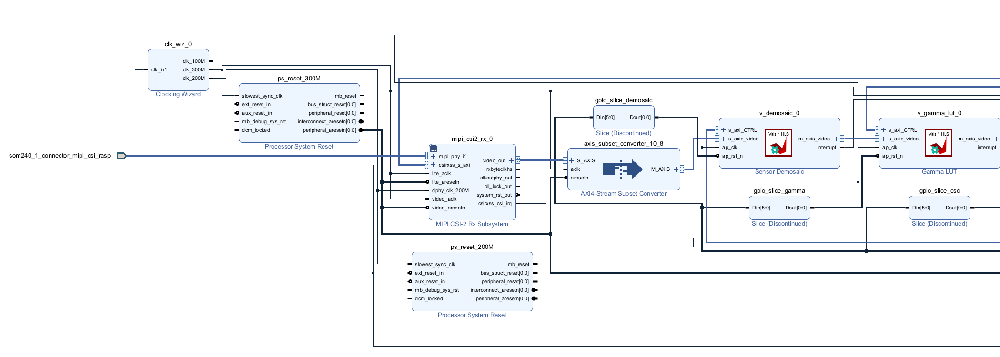
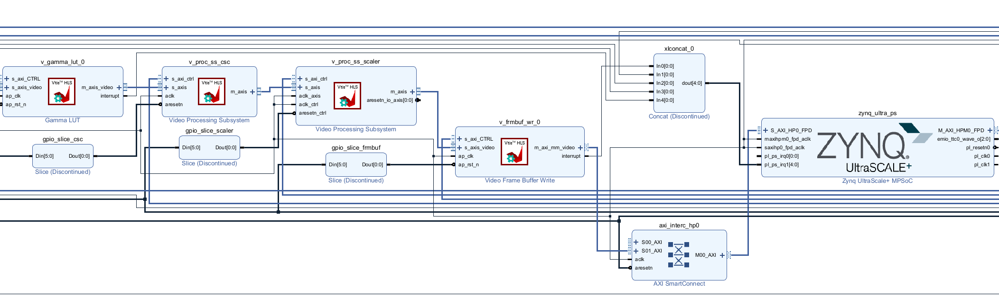
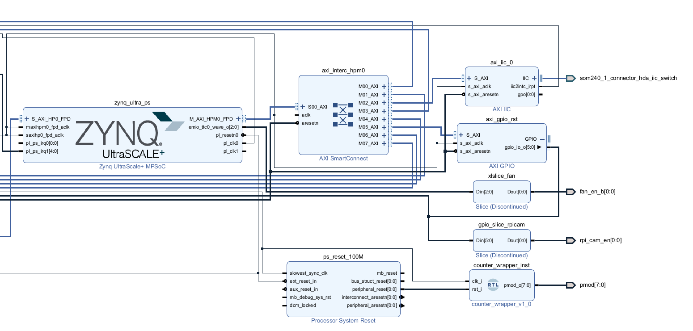

# Forwarding the video to the DP output with Ubuntu running on the PS

## Table of contents
<ol>
    <li><a href="#About-The-Project">About the project</a></li>
    <li><a href="#Hardware-Design">Hardware Design</a></li>
    <li><a href="#Software-design">Software design</a></li>
    <li><a href="#Prerequisites">Prerequisites</a></li>
    <li><a href="#Usage">Usage</a></li>
    <li><a href="#References">References</a></li>
    <li><a href="#Contact">Contact</a></li>
</ol>

## About the project <a id="About-The-Project"></a>

Having generated video from the PL and forwarded it to the video output in the AMD KV260 platform, the next step is to find a way to make the same work when Ubuntu is running on the PS side. In standalone, I had a simple application running on the A53 that configured the Display Port (DP) and its DMA to enable the Live video input (coming from the PL) in the DP controller. 

This project now implements a complete V4L2-based video pipeline that leverages standard Linux frameworks for camera control, video processing, and display. The approach moves from bare-metal register manipulation to using kernel drivers, media controllers, and GStreamer for a more robust and maintainable solution that integrates seamlessly with Ubuntu 22.04.

## Hardware design <a id="Hardware-Design"></a>


The hardware design implements a complete video pipeline from the OV5647 Raspberry Pi camera to DDR memory using standard Linux V4L2 frameworks. The design transitions from bare-metal AXI VDMA to the modern `xilinx-frmbuf` driver for better Linux compatibility.

### Video Pipeline Architecture

The video processing pipeline consists of the following IP blocks:

```
OV5647 Camera
     │ (MIPI CSI-2, 2 lanes, RAW10)
     ▼
MIPI CSI-2 RX Subsystem
     │ (AXI-Stream, RAW10)
     ▼
AXI Subset Converter
     │ (AXI-Stream, RAW8)
     ▼
Video Demosaic
     │ (AXI-Stream, RGB888)
     ▼
Video Gamma LUT
     │ (AXI-Stream, RGB888)
     ▼
VPSS CSC (Color Space Conv.)
     │ (AXI-Stream, RGB888)
     ▼
VPSS Scaler (Hardware Scaling)
     │ (AXI-Stream, RGB888)
     ▼
Video Frame Buffer Write
     │ (AXI DMA, DDR Memory)
     ▼
Linux V4L2 Driver (/dev/video0)
```
The resulting Vivado block diagram is shown below.






### Key IP Components

**Video Processing IPs:**
- **MIPI CSI-2 RX Subsystem** - Camera interface with 2-lane DPHY, RAW10→RAW8 conversion
- **AXI Subset Converter** - RAW10 to RAW8 data conversion (16-bit to 8-bit)
- **Video Demosaic** - Bayer pattern to RGB888 conversion
- **Video Gamma LUT** - Gamma correction for RGB888 data
- **VPSS CSC** - Color space conversion (RGB888 input/output)
- **VPSS Scaler** - Hardware up/down scaling (RGB888)
- **Video Frame Buffer Write** - Memory DMA supporting multiple formats including NV12

**Control & Support IPs:**
- **AXI IIC** - I2C controller for camera communication via PCA9546 mux
- **AXI GPIO** - Reset controller for all video IPs
- **Counter Wrapper** - Debug/test output

### I2C Topology

Unlike bare-metal implementations that use PS I2C1 (EMIO), the Linux V4L2 approach routes I2C through the PL:

```
PS ARM → AXI IIC (PL IP @ 0xa0040000) → PCA9546 Mux (addr 0x74) → Channel 2 → OV5647 (addr 0x36)
```

This creates a chain of Linux I2C adapters that the kernel drivers manage automatically.

## Software design <a id="Software-design"></a>

The software architecture leverages standard Linux V4L2 frameworks running on Ubuntu 22.04. The implementation uses kernel drivers, media controllers, and GStreamer to create a complete video pipeline from the OV5647 camera to display output.

### Key Software Components

**Linux Kernel Drivers:**
- `ov5647.ko` - OV5647 camera sensor driver (patched for KV260 I2C timeout issues)
- `xilinx-frmbuf` - Video Frame Buffer Write driver for memory DMA
- `xilinx-demosaic` - Bayer to RGB conversion driver
- `xilinx-gamma-lut` - Gamma correction driver
- `xilinx-vpss-scaler` - Hardware scaling driver
- `xilinx-video` - Xilinx video framework binding all IPs together
- `pca954x` - I2C multiplexer driver

**Media Controller Framework:**
- `media-ctl` - Configures pad-to-pad pipeline links between hardware blocks
- `v4l2-ctl` - Real-time camera parameter tuning (brightness, contrast, gamma)
- `/dev/media0` - Media device representing the complete video pipeline

**Application Layer:**
- **GStreamer Pipeline** - Uses `mediasrcbin` → `v4l2src` → `kmssink` for zero-copy video streaming
- **DRM (Direct Rendering Manager) /KMS (Kernel Mode Setting)** - DisplayPort controller management via `kmssink`
- **Device Tree Overlay** - Dynamic hardware loading via `xmutil`

### Software Architecture Flow

```
OV5647 Camera → Linux Kernel Drivers → Media Controller → V4L2 API → GStreamer → DRM/KMS → Display
```

## Prerequisites <a id="Prerequisites"></a>

**Hardware:**
- [AMD KV260](https://www.xilinx.com/products/som/kria/kv260-vision-starter-kit.html)
- External monitor
- HDMI or DisplayPort cable connecting the external monitor and the KV260
- OV5647 Raspberry Pi Camera V2 sensor module

**Development Tools:**
- [AMD Vivado Design Suite](https://www.xilinx.com/products/design-tools/vivado.html) for generating the project, the output artefacts, programming the FPGA, etc.
- [cocotb](https://www.cocotb.org/) as testbenching framework
- [Questa advanced simulator](https://eda.sw.siemens.com/en-US/ic/questa/simulation/advanced-simulator/) as simulator. Opensource alternatives such as [GHDL](https://github.com/ghdl/ghdl) + [gtkwave](https://github.com/gtkwave/gtkwave) are also good options (they would require minor modifications in the test Makefile)

**Software (KV260 Ubuntu 22.04):**
- Ubuntu 22.04 for Kria SOM (official Kria image)
- Kernel headers for building OV5647 driver: `linux-headers-$(uname -r)`
- V4L2 and media controller utilities: `v4l-utils`, `yavta`, `i2c-tools`
- GStreamer with Xilinx plugins: `gstreamer1.0-tools`, `gstreamer1.0-plugins-good`, `gstreamer1.0-plugins-bad`, `gstreamer1.0-xilinx`
- Device tree compiler: `device-tree-compiler`
- DRM development libraries: `libdrm-xlnx-dev`
- Build tools for kernel modules: `build-essential`

## Usage <a id="Usage"></a>

See [`plan_port_v4l2.md`](plan_port_v4l2.md) for complete instructions on how to build, deploy and run the project. 

**Hardware Build (from development machine):**
```bash
# Note: Pre-generated artifacts are available in output/artifacts_save/

# Build Vivado project and generate artifacts
python output/build_vivado_proj.py --target all --dev-flow vivado_accelerator \
  --vivado-path /opt/Xilinx/Vivado/2022.1/bin/vivado \
  --vitis-path /opt/Xilinx/Vitis/2022.1/bin/vitis \
  --bootgen-path /opt/Xilinx/Vivado/2022.1/bin/bootgen \
  --dtc-path /opt/Xilinx/Vitis/2022.1/bin/dtc

# Note: The script will pause for manual DTSI editing to add OV5647 sensor information
```

**One-Time Setup (from KV260):**
```bash
# Install required packages
sudo apt update
sudo apt install -y linux-headers-$(uname -r) v4l-utils yavta i2c-tools device-tree-compiler
sudo apt install -y gstreamer1.0-tools gstreamer1.0-plugins-good gstreamer1.0-plugins-bad gstreamer1.0-xilinx
sudo apt install -y libdrm-xlnx-dev build-essential

# Build and install patched OV5647 driver
cd sw/ov5647_driver_patched
make
sudo cp ov5647.ko /lib/modules/$(uname -r)/kernel/drivers/media/i2c/ov5647.ko
sudo depmod -a
```

**Quick Start (from KV260):**
```bash
# Load hardware overlay
sudo xmutil unloadapp
sudo xmutil loadapp kv260_rpicamera_to_dp

# Configure the pipeline
sudo chmod +x sw/setup_v4l2.sh
sudo ./sw/setup_v4l2.sh

# Stream video to display
sudo xmutil desktop_disable # Disable desktop to free display resources
gst-launch-1.0 mediasrcbin media-device=/dev/media0 v4l2src0::io-mode=mmap ! \
  video/x-raw, width=1920, height=1080, format=NV12, framerate=30/1 ! \
  kmssink driver-name=xlnx plane-id=39 fullscreen-overlay=true sync=false
```

## References <a id="References"></a>

**Project Documentation:**
- [`plan_port_v4l2.md`](plan_port_v4l2.md) - Complete V4L2 porting plan and detailed instructions

**Xilinx V4L2 & Smart Camera Resources:**
- [Xilinx Smart Camera Project](https://xilinx.github.io/kria-apps-docs/kv260/2022.1/build/html/docs/smartcamera/docs/sw_arch_platform.html) - V4L2 TRD framework reference
- [RasPi-Camera-V2-KV260](https://github.com/ikwzm/RasPi-Camera-V2-KV260) - VPSS-centric Ubuntu implementation
- [KV260_IMX477_CAMERA](https://github.com/zakinder/KV260_IMX477_CAMERA) - Bare-metal reference implementation
- [Xilinx Kria Vitis Platforms](https://github.com/Xilinx/kria-vitis-platforms/) - Platform development resources

**Xilinx Hardware Documentation:**
- [Zynq UltraScale+ Device Technical Reference Manual](https://docs.xilinx.com/r/en-US/ug1085-zynq-ultrascale-trm) - DisplayPort Controller and hardware interfaces
- [Kria KV260 Vision AI Starter Kit User Guide (UG1089)](https://docs.xilinx.com/r/en-US/ug1089-kv260-starter-kit/Summary)
- [Kria KV260 Vision AI Starter Kit Data Sheet (DS986)](https://docs.xilinx.com/r/en-US/ds986-kv260-starter-kit/Summary)
- [Kria K26 SOM Data Sheet (DS987)](https://docs.xilinx.com/r/en-US/ds987-k26-som/Overview)
- [Kria KV260 Vision AI Starter Kit Applications](https://xilinx.github.io/kria-apps-docs/kv260/2022.1/build/html/index.html)
- [Steps to set up the KV260 board and Ubuntu](https://www.xilinx.com/products/som/kria/kv260-vision-starter-kit/kv260-getting-started-ubuntu/setting-up-the-sd-card-image.html)
- [Kria SOM Carrier Card Design Guide (UG1091)](https://docs.xilinx.com/r/en-US/ug1091-carrier-card-design/MIO-Signals)
- [AMD AXI VDMA documentation](https://docs.xilinx.com/r/en-US/pg020_axi_vdma)
- [Pynq documentation](https://pynq.readthedocs.io/en/v2.1/getting_started.html)

**Linux & Software Resources:**
- [Ubuntu 22.04 for Kria SOM](https://ubuntu.com/download/amd#kria-k26) - Official Ubuntu image
- [Linux V4L2 Documentation](https://www.kernel.org/doc/html/latest/driver-api/media/v4l2-core.html) - V4L2 framework reference
- [GStreamer Documentation](https://gstreamer.freedesktop.org/documentation/) - GStreamer pipeline development
- [Media Controller Documentation](https://www.kernel.org/doc/html/latest/driver-api/media/mc-core.html) - Media controller framework

**Community & Support:**
- [AMD Video Series and Blog Posts](https://support.xilinx.com/s/question/0D52E00006hpsS0SAI/xilinx-video-series-and-blog-posts?language=en_US) - Video processing tutorials

## Contact <a id="Contact"></a>

[![LinkedIn][linkedin-shield]][linkedin-url]


<p align="right">(<a href="#top">back to top</a>)</p>

<!-- README built based on this nice template: https://github.com/othneildrew/Best-README-Template -->

<!-- MARKDOWN LINKS & IMAGES -->

[linkedin-shield]: https://img.shields.io/badge/LinkedIn-0077B5?style=for-the-badge&logo=linkedin&logoColor=white
[linkedin-url]: https://www.linkedin.com/in/juan-manuel-reina-mu%C3%B1oz-56329b130/
