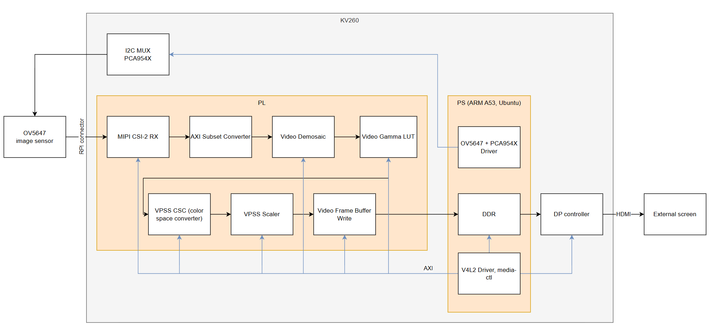

# Forwarding the video to the DP output with Ubuntu running on the PS

## Table of contents
<ol>
    <li><a href="#About-The-Project">About the project</a></li>
    <li><a href="#Hardware-Design">Hardware Design</a></li>
    <li><a href="#Software-design">Software design</a></li>
    <li><a href="#Prerequisites">Prerequisites</a></li>
    <li><a href="#Usage">Usage</a></li>
    <li><a href="#References">References</a></li>
    <li><a href="#Contact">Contact</a></li>
</ol>

## About the project <a id="About-The-Project"></a>

Having generated video from the PL and forwarded it to the video output in the AMD KV260 platform, the next step is to find a way to make the same work when Ubuntu is running on the PS side. In standalone, I had a simple application running on the A53 that configured the Display Port (DP) and its DMA to enable the Live video input (coming from the PL) in the DP controller. 

This project now implements a complete V4L2-based video pipeline that leverages standard Linux frameworks for camera control, video processing, and display. The approach moves from bare-metal register manipulation to using kernel drivers, media controllers, and GStreamer for a more robust and maintainable solution that integrates seamlessly with Ubuntu 22.04.



## Hardware design <a id="Hardware-Design"></a>


The hardware design implements a complete video pipeline from the OV5647 Raspberry Pi camera to DDR memory using standard Linux V4L2 frameworks. The design transitions from bare-metal AXI VDMA to the modern `xilinx-frmbuf` driver for better Linux compatibility.

### Video Pipeline Architecture

The video processing pipeline consists of the following IP blocks:

```
OV5647 Camera
     │ (MIPI CSI-2, 2 lanes, RAW10)
     ▼
MIPI CSI-2 RX Subsystem
     │ (AXI-Stream, RAW10)
     ▼
AXI Subset Converter
     │ (AXI-Stream, RAW8)
     ▼
Video Demosaic
     │ (AXI-Stream, RGB888)
     ▼
Video Gamma LUT
     │ (AXI-Stream, RGB888)
     ▼
VPSS CSC (Color Space Conv.)
     │ (AXI-Stream, RGB888)
     ▼
VPSS Scaler (Hardware Scaling)
     │ (AXI-Stream, RGB888)
     ▼
Video Frame Buffer Write
     │ (AXI DMA, DDR Memory)
     ▼
VCU (Video Codec Unit)
     │ (H.264/H.265 Hardware Encoding)
     ▼
Linux V4L2 Driver (/dev/video0)
```

The resulting Vivado block diagram is shown below (VCU missing)


### Key IP Components

**Video Processing IPs:**
- **MIPI CSI-2 RX Subsystem** - Camera interface with 2-lane DPHY, RAW10→RAW8 conversion
- **AXI Subset Converter** - RAW10 to RAW8 data conversion (16-bit to 8-bit)
- **Video Demosaic** - Bayer pattern to RGB888 conversion
- **Video Gamma LUT** - Gamma correction for RGB888 data
- **VPSS CSC** - Color space conversion (RGB888 input/output)
- **VPSS Scaler** - Hardware up/down scaling (RGB888)
- **Video Frame Buffer Write** - Memory DMA supporting multiple formats including NV12
- **VCU (Video Codec Unit)** - Hardware H.264/H.265 encoding/decoding with low-latency streaming support

**Control & Support IPs:**
- **AXI IIC** - I2C controller for camera communication via PCA9546 mux
- **AXI GPIO** - Reset controller for all video IPs
- **Counter Wrapper** - Debug/test output

### OV5647 Camera Sensor Specifications

The camera module used is the Raspberry Camera module 1. It features an OV5647 sensor, which is a 5-megapixel CMOS image sensor.

[Raspberry Pi Camera Module](https://www.raspberrypi.com/documentation/accessories/camera.html)
[OV5647 Datasheet](https://cdn.sparkfun.com/datasheets/Dev/RaspberryPi/ov5647_full.pdf)

| Specification | Value |
|---------------|-------|
| **Sensor** | 5-Megapixel 1/4" CMOS (OmniBSI technology) |
| **Pixel Size** | 1.4 µm x 1.4 µm |
| **Active Array** | 2592 × 1944 pixels |
| **Interface** | 2-lane MIPI CSI-2 (High-speed) or Digital Video Parallel port (DVP) |
| **Max Frame Rate** | QSXGA (2592×1944): 15 fps<br>1080p: 30 fps<br>720p: 60 fps<br>VGA (640×480): 90 fps |
| **Output Formats** | 8-bit / 10-bit RAW RGB data |
| **Dynamic Range** | 67 dB @ 8× gain |
| **Power Supply** | Core 1.5V, Analog 2.6–3.0V, I/O 1.7–3.0V |

Current config: 2-lane MIPI CSI-2 interface with RAW10 output format.

### VCU (Video Codec Unit)

Hardware-accelerated H.264/H.265 video encoder/decoder for ultra-low latency streaming applications.

[H.264/H.265 Video Codec Unit v1.2 Solutions LogiCORE IP Product Guide (PG252)](https://docs.xilinx.com/r/en-US/pg252-vcu)

| Specification | Value |
|---------------|-------|
| **Codec Support** | H.264 (AVC), H.265 (HEVC) |
| **Max Resolution** | 4K @ 60fps (H.265), 1080p @ 60fps (H.264) |
| **H.264 Levels** | 1.0 - 4.2 (1080p30) |
| **H.265 Levels** | 1.0 - 5.1 (4K) |
| **Bitrate Range** | 1 - 40 Mbps |
| **Profiles** | H.264: Baseline, Main, High<br>H.265: Main, Main 10 |

Current config: H.264 encoder only, 4k@30fps max, 8bpc.

### MIPI CSI-2 RX Subsystem

Receives and decodes high-speed MIPI CSI-2 serial traffic into an AXI4-Stream video interface.

[MIPI CSI-2 Receiver Subsystem Product Guide (PG232)](https://docs.amd.com/r/en-US/pg232-mipi-csi2-rx)

| Specification | Value |
|---------------|-------|
| **Number of D-PHY lanes** | 1 ... 4 |
| **Pixels per clock** | 1, 2, 4, or 8 |
| **Line rate** | up to 3200 Mb/s or 4500 Mb/s |
| **Supported data types** | RAW6 through RAW20, RGB, YUV422, YUV420 |
| **Virtual Channel filtering** | Yes/No |

Current config: 2 lanes, 1 pixel per clock, 3200 Mb/s line rate, RAW10 data type, virtual channel filtering enabled.     

### AXI Subset Converter

Remaps, truncates, or pads AXI4-Stream signals. 

[AXI4-Stream Infrastructure IP Suite LogiCORE IP Product Guide (PG085)](https://docs.amd.com/r/en-US/pg085-axi4stream-infrastructure)

Current config: RAW10 (2 bytes) to RAW8 (1 byte) truncation. It strips the padding from RAW10 to output RAW8.

### Sensor Demosaic

It performs the critical task of reconstructing full color information from the Bayer filter pattern, interpolating the missing color values to create a complete RGB image.

[Sensor Demosaic LogiCORE IP Product Guide (PG286)](https://docs.amd.com/r/en-US/pg286-v-demosaic)

| Specification | Value |
|---------------|-------|
| **Max Resolution** | 8192 × 4320 (8K) @ 60 fps |
| **Bit Depth** | 8, 10, 12, and 16-bit |
| **Samples per Clock** | 1, 2, 4, or 8 |

Current config: 1 sample per clock, RAW8 input to RGB888 output conversion, 4096x2560 max resolution.

### Video Gamma LUT

The Gamma LUT IP applies gamma correction curves to the video data to compensate for the non-linear characteristics of displays and human perception. This ensures that the displayed image has the proper brightness and contrast characteristics. It applies independent Look-Up Tables to the Red, Green, and Blue channels for luminance and contrast correction.

[Gamma Look Up Table LogiCORE IP Product Guide (PG285)](https://docs.amd.com/r/en-US/pg285-v-gamma-lut)

| Specification | Value |
|---------------|-------|
| **Max Resolution** | 8192 × 4320 (8K) @ 60 fps |
| **Bit Depth** | 8 and 10-bit per component |
| **Samples per Clock** | 1, 2, 4, or 8 |
| **Input/Output Format** | RGB, YUV 4:4:4 |

Current config: RGB888 input/output, 8-bit per color component, 4096x2560 max resolution.

### VPSS CSC + Scaler

The Video Processing Subsystem enables streamlined integration of various processing blocks including (but not limited to) scaling, deinterlacing, color space conversion and correction, chroma resampling, and frame rate conversion.
- The CSC functionality (`v_proc_ss_csc`) performs color space conversion between different color formats (e.g., RGB to YUV or vice versa).
- The Scaler functionality (`v_proc_ss_scaler`) performs upscaling and downscaling of video images.

[Video Processing Subsystem Product Guide (PG231)](https://docs.amd.com/r/en-US/pg231-v-proc-ss)

| Specification | Value |
|---------------|-------|
| **Topology** | 3 (Color Space Conversion mode) |
| **Max Resolution** | 8192 × 4320 (8K) @ 60 fps |
| **Bit Depth** | 8, 10, 12, and 16-bit per component |
| **Samples per Clock** | 1, 2, 4, or 8 |
| **Input/Output Format** | RGB, YUV 4:4:4, 4:2:2, 4:2:0 |

### Video Frame Buffer Write

The AMD LogiCORE IP Video Frame Buffer Read and Video Frame Buffer Write are independent cores designed to provide high-bandwidth direct memory access (DMA) between system memory and AXI4-Stream video target peripherals. They are essential for video applications that require frame buffering to manage changes in frame rates or image dimensions, such as scaling and cropping. The cores are fully compliant with the AXI4-Stream Video protocol, AXI4-Lite for control, and AXI4 memory-mapped interfaces for data transfer.

The Video Frame Buffer Read/Write IPs are "video-aware" and natively support multiple color formats (like NV12 or YUV422), whereas the AXI VDMA is a general-purpose 2D DMA that treats video as raw data. This allows the Frame Buffer IPs to handle packing, unpacking, and chroma format mapping internally, simplifying the pipeline and providing better integration with the Linux V4L2 framework.

[Video Frame Buffer Read and Video Frame Buffer Write v3.0 LogiCORE IP Product Guide (PG278)](https://docs.amd.com/r/en-US/pg278-v-frmbuf)

| Specification | Value |
|---------------|-------|
| **Max Resolution** | 15360 × 8640 (Supports 8K60 across all families) |
| **Bit Depth** | 8, 10, 12, and 16-bit per color component |
| **Supported Interfaces** | AXI4-Master, AXI4-Lite, AXI4-Stream |
| **Streaming Video Formats** | RGB, RGBA, YUV 4:4:4, YUVA 4:4:4, YUV 4:2:2, YUV 4:2:0 |
| **Memory Video Formats** | RGBX8/10, YUYV8, NV12, Y_UV8/10 (Semi-Planar), Y_U_V8/10 (Full Planar), Y8/10/12 (Luma-only), etc. |
| **Memory Modes** | Raster Mode and Tile Mode |
| **Software Drivers** | Standalone and Linux DMA Controller |

**Streaming vs Memory Video Formats**:
- **Streaming Video Formats** refer to the data organization on the AXI4-Stream interface (the "live" video bus). On this bus, pixels are sent in a continuous flow following the AXI4-Stream Video protocol. The format defines how components (like R, G, and B) are interleaved within a single TDATA bus cycle as the video moves between IP cores in real-time.
- **Memory Video Formats** refer to how those same pixels are packed and arranged when stored in System Memory (DDR). The Frame Buffer IP acts as a translator; it can take a YUV 4:2:2 stream and "unpack" it into a Full Planar memory format (where Y, U, and V are stored in three completely different memory locations) or a Semi-Planar format (like NV12). This allows the memory layout to be optimized for software processing or for hardware blocks like the Video Codec Unit (VCU).

**Video formats convention**:
- X (e.g., RGBX8): Indicates "don't care" or padding bits used to align data to byte boundaries (e.g., 8-bit components in a 32-bit word).
- Underscore (e.g., Y_UV8): Denotes a Semi-Planar format where Luma (Y) is in one memory plane and Chroma (UV) is interleaved in a second plane.
- Double Underscore (e.g., Y_U_V8): Denotes a Full Planar format where Y, U, and V are each stored in their own separate memory planes.
- Numeric Suffix (8, 10, 12): Specifies the bits per color component (e.g., 8-bit, 10-bit, or 12-bit).
- 420 (e.g., Y_UV8_420): Indicates YUV 4:2:0 chroma subsampling, where chroma resolution is half of luma in both dimensions.

Current config: support RGB8, RGBX8, BGR8, BGRX8, XRGB8, XBGR8, Y_UV8_420 memory formats, max resolution 4096x2160, 8-bit per color component.

### I2C Topology

| Device | Address / Location | Role |
|--------|---------------------|------|
| **AXI IIC Controller** | `0xa0040000` | PL-mapped I2C Master |
| **PCA9546 I2C Mux** | `0x74` | 4-channel I2C Switch |
| **OV5647 Sensor** | `0x36` (Ch 2) | 5MP CMOS Image Sensor |

**Control Path:**
`PS ARM` → `AXI IIC` → `PCA9546 Mux (Channel 2)` → `OV5647 Sensor`

## Software design <a id="Software-design"></a>

The software architecture leverages standard Linux V4L2 frameworks running on Ubuntu 22.04. The implementation uses kernel drivers, media controllers, and GStreamer to create a complete video pipeline from the OV5647 camera to display output.

**Software Architecture Flow**
```
OV5647 Camera → Linux Kernel Drivers → Media Controller → V4L2 API → GStreamer → DRM/KMS → Display
```

**Kernel & Driver Layer**:
- `ov5647.ko` - Camera sensor driver (patched for KV260 I2C timeout issues)
- `pca954x` - I2C multiplexer driver managing the control bus to the sensor
- `xilinx-frmbuf` - Video Frame Buffer Write driver for memory DMA
- `xilinx-demosaic` - Bayer to RGB conversion driver
- `xilinx-gamma-lut` - Gamma correction driver
- `xilinx-vpss-scaler` - Hardware scaling driver
- `xilinx-video` - Xilinx video framework binding all IP subdevices together

**User Space & Application Layer**:
- **Media Controller Framework:**
  - `v4l2-ctl` - Real-time camera parameter tuning (brightness, contrast, gamma)
  - `media-ctl` - Configures pad-to-pad pipeline links between hardware blocks
  - `/dev/media0` - Media device representing the complete video pipeline topology
  - `/dev/video0` - V4L2 video device node used for capturing the final processed stream

- **Application & Display:**
  - **Device Tree Overlay** - Dynamic hardware loading via `xmutil`
  - **GStreamer Pipeline** - Uses `mediasrcbin` → `v4l2src` → `kmssink` for zero-copy video streaming
  - **DRM (Direct Rendering Manager) /KMS (Kernel Mode Setting)** - DisplayPort controller management via `kmssink`

## Prerequisites <a id="Prerequisites"></a>

**Hardware:**
- [AMD KV260](https://www.xilinx.com/products/som/kria/kv260-vision-starter-kit.html)
- External monitor
- HDMI or DisplayPort cable connecting the external monitor and the KV260
- OV5647 Raspberry Pi Camera V2 sensor module

**Development Tools:**
- [AMD Vivado Design Suite](https://www.xilinx.com/products/design-tools/vivado.html) for generating the project, the output artefacts, programming the FPGA, etc.
- [cocotb](https://www.cocotb.org/) as testbenching framework
- [Questa advanced simulator](https://eda.sw.siemens.com/en-US/ic/questa/simulation/advanced-simulator/) as simulator. Opensource alternatives such as [GHDL](https://github.com/ghdl/ghdl) + [gtkwave](https://github.com/gtkwave/gtkwave) are also good options (they would require minor modifications in the test Makefile)

**Software (KV260 Ubuntu 22.04):**
- Ubuntu 22.04 for Kria SOM (official Kria image)
- Kernel headers for building OV5647 driver: `linux-headers-$(uname -r)`
- V4L2 and media controller utilities: `v4l-utils`, `yavta`, `i2c-tools`
- GStreamer with Xilinx plugins: `gstreamer1.0-tools`, `gstreamer1.0-plugins-good`, `gstreamer1.0-plugins-bad`, `gstreamer1.0-xilinx`
- Device tree compiler: `device-tree-compiler`
- DRM development libraries: `libdrm-xlnx-dev`
- Build tools for kernel modules: `build-essential`

## Usage <a id="Usage"></a>

See [`plan_port_v4l2.md`](plan_port_v4l2.md) for complete instructions on how to build, deploy and run the project. 

**Hardware Build (from development machine):**
```bash
# Note: Pre-generated artifacts are available in output/artifacts_save/

# Build Vivado project and generate artifacts
python output/build_vivado_proj.py --target all --dev-flow vivado_accelerator \
  --vivado-path /opt/Xilinx/Vivado/2022.1/bin/vivado \
  --vitis-path /opt/Xilinx/Vitis/2022.1/bin/vitis \
  --bootgen-path /opt/Xilinx/Vivado/2022.1/bin/bootgen \
  --dtc-path /opt/Xilinx/Vitis/2022.1/bin/dtc

# Note: The script will pause for manual DTSI editing to add OV5647 sensor information
```

**One-Time Setup (from KV260):**
```bash
# Install Xilinx PPA and required packages for VCU
sudo add-apt-repository ppa:ubuntu-xilinx/updates
sudo add-apt-repository ppa:xilinx-apps/ppa
sudo apt update
sudo apt install -y linux-headers-$(uname -r) v4l-utils yavta i2c-tools device-tree-compiler
sudo apt install -y gstreamer-xilinx1.0-tools gstreamer-xilinx1.0-plugins-good gstreamer-xilinx1.0-plugins-bad gstreamer-xilinx1.0-omx-zynqmp
sudo apt install -y libdrm-xlnx-dev build-essential
sudo apt install -y v4l-utils-xlnx

# Build and install patched OV5647 driver
cd sw/ov5647_driver_patched
make
sudo cp ov5647.ko /lib/modules/$(uname -r)/kernel/drivers/media/i2c/ov5647.ko
sudo depmod -a
```

**Quick Start (from KV260):**

1)  Load hardware overlay:
    ```bash
    sudo xmutil unloadapp
    sudo xmutil loadapp kv260_rpicamera_to_dp
    ```

2) Option A. Stream to DisplayPort (1440p):
     ```bash
     sudo chmod +x sw/setup_v4l2.sh
     sudo ./sw/setup_v4l2.sh
     sudo xmutil desktop_disable # Disable desktop to free display resources
     sudo gst-launch-1.0 v4l2src device=/dev/video0 io-mode=mmap ! \
     video/x-raw, width=2560, height=1440, format=RGB ! \
     kmssink driver-name=xlnx plane-id=40 sync=false
     ```

3) Option B. Stream over network (1080p, VCU hardware encoding, multicast, ~300-400ms latency)
     ```bash
     # From KV260
     sudo ufw disable
     sudo chmod +x sw/setup_vcu_udp.sh
     sudo ./sw/setup_vcu_udp.sh
     sudo gst-launch-1.0 -v v4l2src device=/dev/video0 io-mode=mmap ! \
     "video/x-raw, width=1920, height=1080, format=NV12, framerate=30/1" ! \
     omxh264enc target-bitrate=6000 control-rate=low-latency prefetch-buffer=true \
     gop-length=3 b-frames=0 periodicity-idr=3 num-slices=8 ! \
     "video/x-h264, profile=main, level=(string)4.2, alignment=au" ! \
     h264parse config-interval=1 ! rtph264pay config-interval=1 pt=96 mtu=1200 ! \
     udpsink host=224.1.1.1 port=5000 auto-multicast=true ttl-mc=1 sync=false async=false
     ```
     ```powershell
     # From client, connect to multicast with: 
     # Windows
     & "C:\Program Files\VideoLAN\VLC\vlc.exe" sw\stream_multicast.sdp --network-caching=30
     # Linux
     vlc sw/stream_multicast.sdp --network-caching=30
     ```

## References <a id="References"></a>

**Project Documentation:**
- [`plan_port_v4l2.md`](plan_port_v4l2.md) - Complete V4L2 porting plan and detailed instructions

**Reference projects:**
- [Xilinx Smart Camera Project](https://xilinx.github.io/kria-apps-docs/kv260/2022.1/build/html/docs/smartcamera/docs/sw_arch_platform.html) - V4L2 TRD framework reference
- [RasPi-Camera-V2-KV260](https://github.com/ikwzm/RasPi-Camera-V2-KV260) - VPSS-centric Ubuntu implementation
- [KV260_IMX477_CAMERA](https://github.com/zakinder/KV260_IMX477_CAMERA) - Bare-metal reference implementation
- [Xilinx Kria Vitis Platforms](https://github.com/Xilinx/kria-vitis-platforms/) - Platform development resources
- [Kria KV260 Vision AI Starter Kit Applications](https://xilinx.github.io/kria-apps-docs/kv260/2022.1/build/html/index.html)

**Xilinx KV260 Documentation:**
- [Zynq UltraScale+ Device Technical Reference Manual](https://docs.xilinx.com/r/en-US/ug1085-zynq-ultrascale-trm) - DisplayPort Controller and hardware interfaces
- [Kria KV260 Vision AI Starter Kit User Guide (UG1089)](https://docs.xilinx.com/r/en-US/ug1089-kv260-starter-kit/Summary)
- [Kria KV260 Vision AI Starter Kit Data Sheet (DS986)](https://docs.xilinx.com/r/en-US/ds986-kv260-starter-kit/Summary)
- [Kria K26 SOM Data Sheet (DS987)](https://docs.xilinx.com/r/en-US/ds987-k26-som/Overview)
- [Kria SOM Carrier Card Design Guide (UG1091)](https://docs.xilinx.com/r/en-US/ug1091-carrier-card-design/MIO-Signals)
- [Steps to set up the KV260 board and Ubuntu](https://www.xilinx.com/products/som/kria/kv260-vision-starter-kit/kv260-getting-started-ubuntu/setting-up-the-sd-card-image.html)
- [Ubuntu 22.04 for Kria SOM](https://ubuntu.com/download/amd#kria-k26) - Official Ubuntu image

**Xilinx IPs**:
- [MIPI CSI-2 Receiver Subsystem Product Guide (PG232)](https://docs.amd.com/r/en-US/pg232-mipi-csi2-rx)
- [AXI4-Stream Infrastructure IP Suite LogiCORE IP Product Guide (PG085)](https://docs.amd.com/r/en-US/pg085-axi4stream-infrastructure)
- [Sensor Demosaic LogiCORE IP Product Guide (PG286)](https://docs.amd.com/r/en-US/pg286-v-demosaic)
- [Gamma Look Up Table LogiCORE IP Product Guide (PG285)](https://docs.amd.com/r/en-US/pg285-v-gamma-lut)
- [Video Processing Subsystem Product Guide (PG231)](https://docs.amd.com/r/en-US/pg231-v-proc-ss)
- [Video Frame Buffer Read and Video Frame Buffer Write v3.0 LogiCORE IP Product Guide (PG278)](https://docs.amd.com/r/en-US/pg278-v-frmbuf)
- [AMD AXI VDMA documentation](https://docs.xilinx.com/r/en-US/pg020_axi_vdma)

**Camera**:
- [Raspberry Pi Camera Module](https://www.raspberrypi.com/documentation/accessories/camera.html)
- [OV5647 Datasheet](https://cdn.sparkfun.com/datasheets/Dev/RaspberryPi/ov5647_full.pdf)

**Linux & Software Resources:**
- [Linux V4L2 Documentation](https://www.kernel.org/doc/html/latest/driver-api/media/v4l2-core.html) - V4L2 framework reference
- [GStreamer Documentation](https://gstreamer.freedesktop.org/documentation/) - GStreamer pipeline development
- [Media Controller Documentation](https://www.kernel.org/doc/html/latest/driver-api/media/mc-core.html) - Media controller framework
- [Pynq documentation](https://pynq.readthedocs.io/en/v2.1/getting_started.html)

**Community & Support:**
- [AMD Video Series and Blog Posts](https://support.xilinx.com/s/question/0D52E00006hpsS0SAI/xilinx-video-series-and-blog-posts?language=en_US) - Video processing tutorials

## Contact <a id="Contact"></a>

[![LinkedIn][linkedin-shield]][linkedin-url]


<p align="right">(<a href="#top">back to top</a>)</p>

<!-- README built based on this nice template: https://github.com/othneildrew/Best-README-Template -->

<!-- MARKDOWN LINKS & IMAGES -->

[linkedin-shield]: https://img.shields.io/badge/LinkedIn-0077B5?style=for-the-badge&logo=linkedin&logoColor=white
[linkedin-url]: https://www.linkedin.com/in/juan-manuel-reina-mu%C3%B1oz-56329b130/
